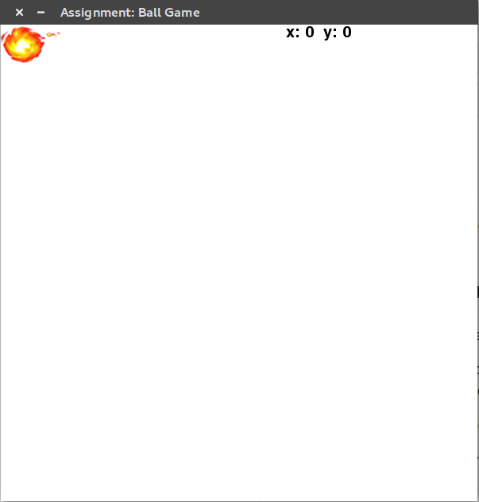
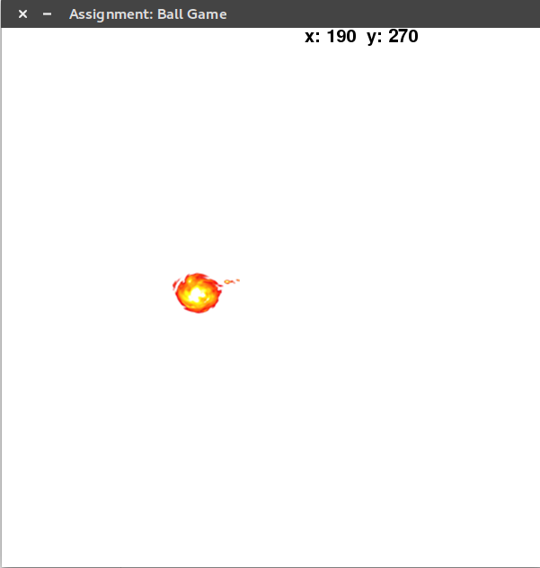

# fireball
Fireball is python game using pygame where player has to save itself from the fireball. Longer the time it saves itself more the points.

## How the game works?
 - Player starts the game and there will a player and a fireball initially.  

 - Player have dogde the ball using the keybords arrow keys, where the fireball will have random position change which will try to follow the player.  

 - After a specific time according to the levels (Easy|Medium|Hard) more fireballs should be added to the game.  
 - If player collide with any of the fireballs, game ends and displays the total score.

## Gameplay Screenshots

Initial state of the game:

Another screenshot from gameplay:

